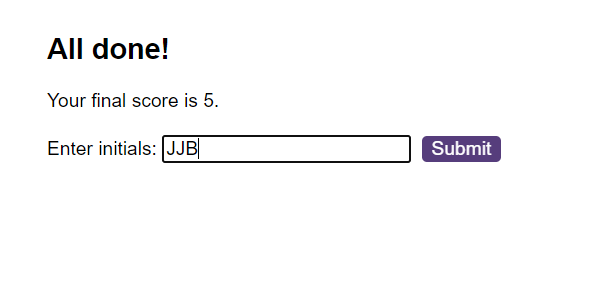

**JavaScript Quiz Challenge**

## Description

This project is a timed quiz on JavaScript fundamentals that allows coding boot camp students to test their knowledge and compare their progress to their peers. The quiz consists of a set of questions with multiple-choice answers, and users can save their high scores at the end of the quiz.

## User Story

AS A coding boot camp student
I WANT to take a timed quiz on JavaScript fundamentals that stores high scores
SO THAT I can gauge my progress compared to my peers

## Acceptance Criteria

The project includes the following features:

- A start button initiates the quiz.
When clicked, a timer starts, and the first question is displayed.
Question Navigation:

- Questions contain buttons for each answer.
When an answer is clicked, the next question appears.
If the clicked answer is incorrect, time is subtracted from the clock.
Quiz End:

- The quiz ends when all questions are answered or when the timer reaches 0.
Results Display:

- When the game ends, the user's score is displayed.
Save High Scores:

- Users can save their initials along with their score.
The ability to save high scores allows users to track their performance.

## Instructions 
```javascript
git clone git@github.com:jjbstudent/Quiz-Game.git
code .
```

## Usage
To run the quiz, open the index.html file in a web browser. Click the "Start Quiz" button to begin the timed quiz on JavaScript fundamentals. Answer the questions, and at the end of the quiz, save your initials and score to compare with other participants.





# Technologies Used
HTML
CSS
JavaScript
Credits
This project is created as part of a coding boot camp, and credit goes to the boot camp instructors and the development community for guidance and support.

## License
This project is licensed under the MIT License.


